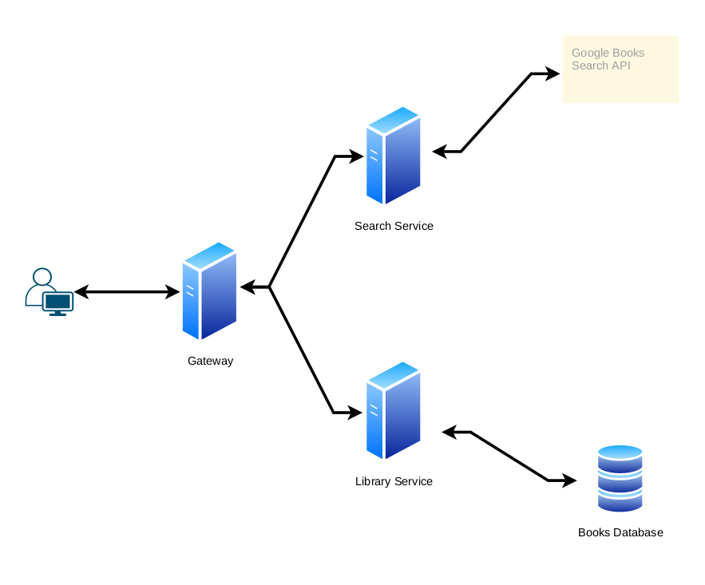

# Personal Library Tracking Microservices Project

## What this is Not!

> `Note: This is not proper documentation, surrounding how to use a product built with microservices. Is simply an explanation of what each microservice does and how I built them for portfolio puroses.`

This project is a WIP, I add to it randomly to try new things.

### Tooling Used

- Golang
- Docker
- Postgres
- Svelte

## Structure

## Gateway Service

Serves as the entry point for all requests from the client.

## Search Book Service

Returns search results for the query param, utilizes a get request to the [Google Books API](https://developers.google.com/books).

## Library Management Service

Handles all requests from user to manage personal library. Connects to a postgres database that handles storage of library books.

## Listener Service (RabbitMQ)

